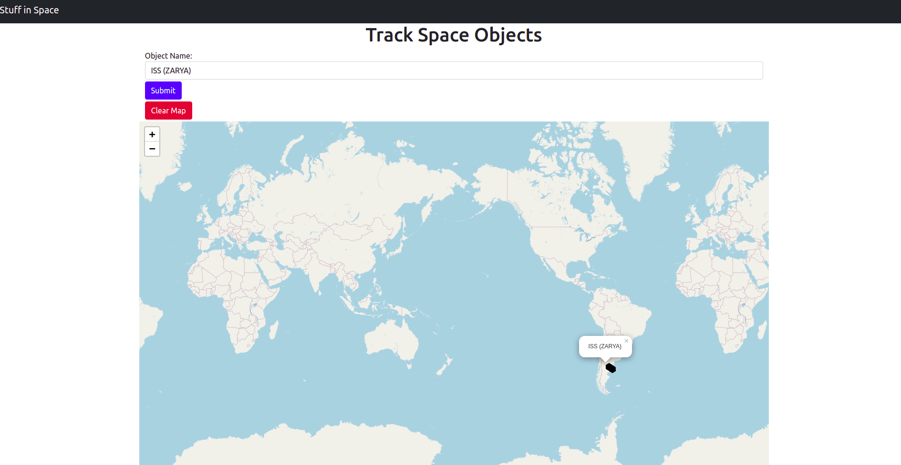

# Stuff in Space

This is a project that tracks all the known objects in space.

Start by typing the space object (stuff) that interests you.
You will be able to track objects in real time.
The may will update the position every 30 seconds.

This app runs by making API calls and there is a limit to the API call.
So, please do not keep it running or search lot of things at a time.
You may have to wait for an hour before you get time to track.

# Running the app

* Clone the repository by `git clone <repository>` where you can copy the repository link from GitHub or download the source files.

* Open `index.html` file in a web browser (preferably Chrome).

* Type your search query in the search box on the home page. **Example**: `ISS (ZARYA)`

* Clear the map by pressing `Clear Map` button on the home page.

# Acknowledgements

* [TLE API](https://tle.ivanstanojevic.me/)

* [Leaflet](https://leafletjs.com/)

* [Bootstrap](https://getbootstrap.com/)

* [favicon.io](https://favicon.io/emoji-favicons/)
